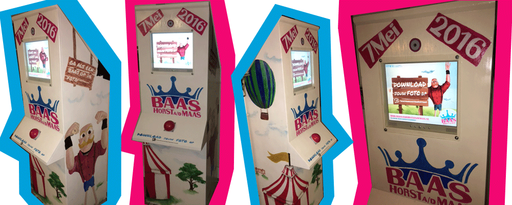
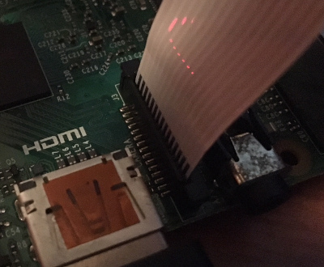
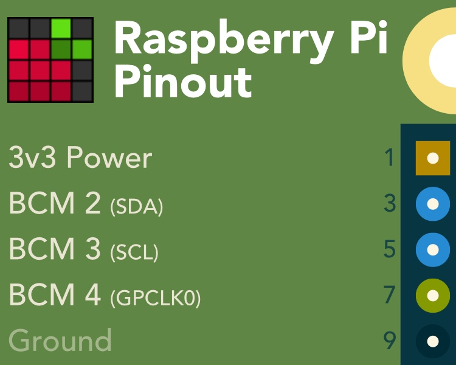
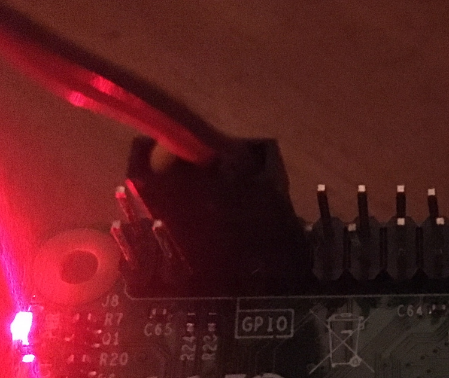

# Selfiebooth Baas van Horst aan de Maas

Python code and assets Selfiebooth Baas van Horst aan de Maas.

## Hardware setup

### 1. Camera module

Connect raspberry PI camera module to board

### 2. GPIO setup for button

We use BCM pin 3 (index 5) since it has an internal pull-up resistor. This means that the digital value will get pulled-up 
to 1 if it is floating (no connection to the ground or a 3v or 5v output). Pin 3 is floating when our switch is open, so since 
we have a pull-up resistor, the digital value will be 1 when the swich (push button) is open (not pressed). If the push button
is pressed, we would like the value to go from 1 to 0 and raise a falling event. Therefore, the other wire needs to be 
attached to the ground (index 9). We use a pull-up vs a pull-down since it is less sensitive for interference.  

Index 3 (BCM pin 3) and index 9 (ground) connection illustration:

Pin layout                          |  Connection
:----------------------------------:|:-------------------------:
  |  

## Software setup

### 1. Prepare raspberry pi image

- Raspbian (tested with [Jessie lite](http://downloads.raspberrypi.org/raspbian_lite/images/raspbian_lite-2017-07-05/2017-07-05-raspbian-jessie-lite.zip)) installation on raspberry pi. Put a `ssh` file in the SD card boot partition to enable ssh server (to enable remote set-up).

### 2. Clone this repository

    sudo apt-get -y update && sudo apt-get install -y git
    git clone https://github.com/reinzor/selfieboot.git ~/selfiebooth

### 3. Run the install script

    ./install

## Configuration file 
The app searches for a USB stick that is inserted to the pi. If a config folder exists with a config.yaml, it will try to load this configuration. If none is found the default_config will be copied to the USB. If another config
directory existed; a backup will be created. 

### Config file parameters
- `bottom_image`: image path
- `top_image`: image path
- `flash_image`: image path
- `countdown_images`: list of image paths, every image takes 1 second
- `screensaver_images`: list of image paths
- `flash_time`: time in secs
- `freeze_time`: time in secs
- `screensaver_time`: time in secs
- `screensaver_slide_time`: time in secs
- `screen_width`: pixel size
- `screen_height`: pixel size

All specified paths are relative to the config file
